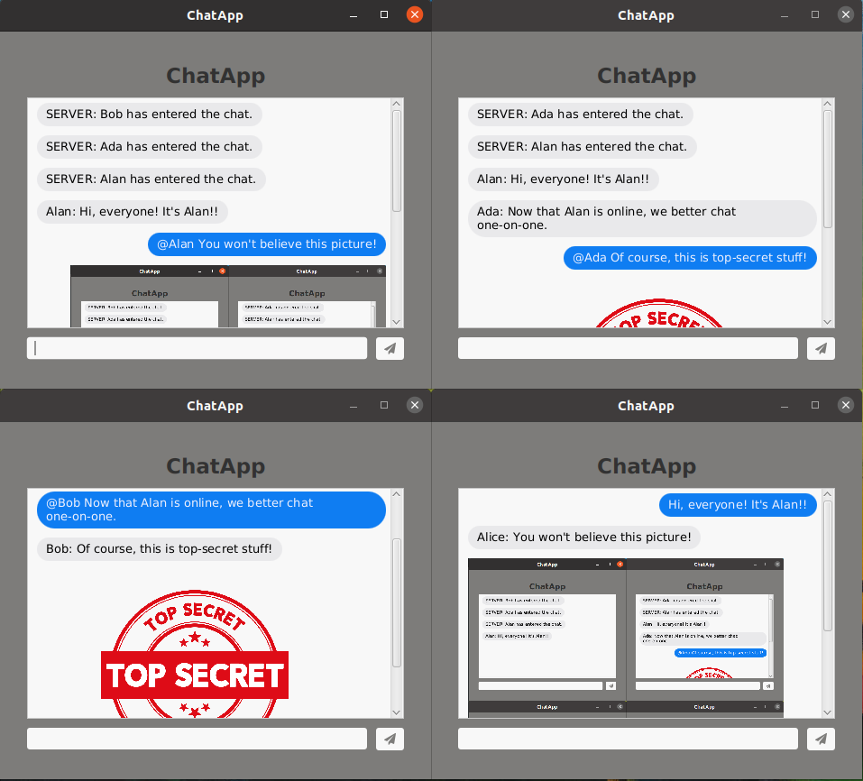

# ChatApp: A chat application that allows multiple clients to communicate via a server.

**Note: This is version 1.0 of an application that is under active development.**

## Current Functionality:
  * The multithreaded server can handle an indefinite number of clients at a time
  * By default, users send messages to all other users in a single chat room
  * However, users may send direct messages to one or more other users
  * In addition to text, users may also send each other images

## Planned Changes:
  * Requiring user accounts (currently users simply enter a name when starting)
  * Loading and storing messages in a database rather than in memory
  * Reading from config files rather than hardcoded values (e.g. ports)
